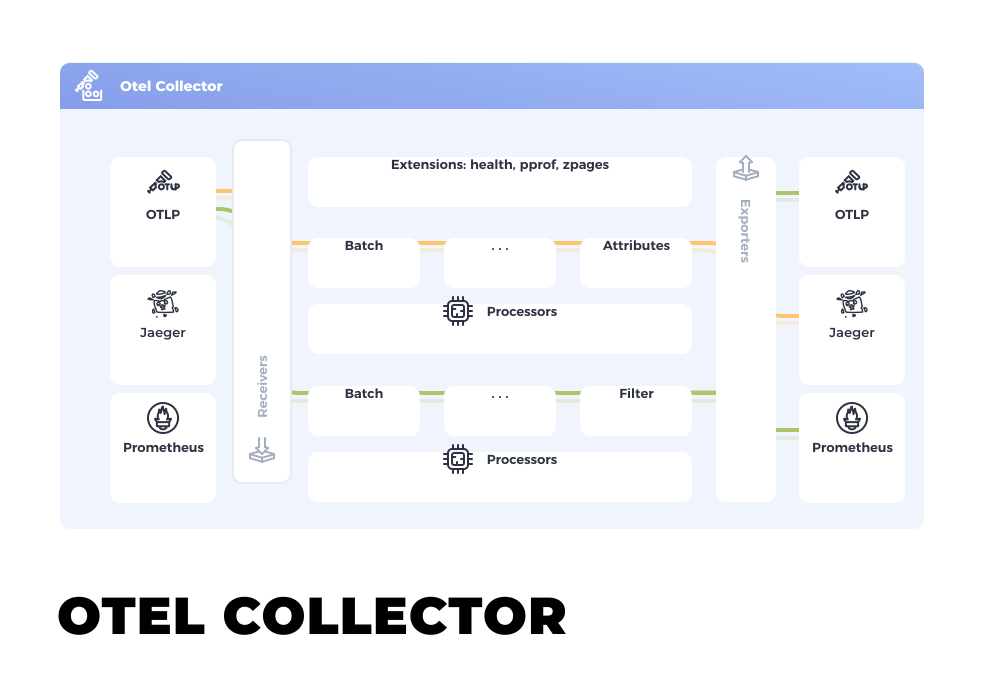
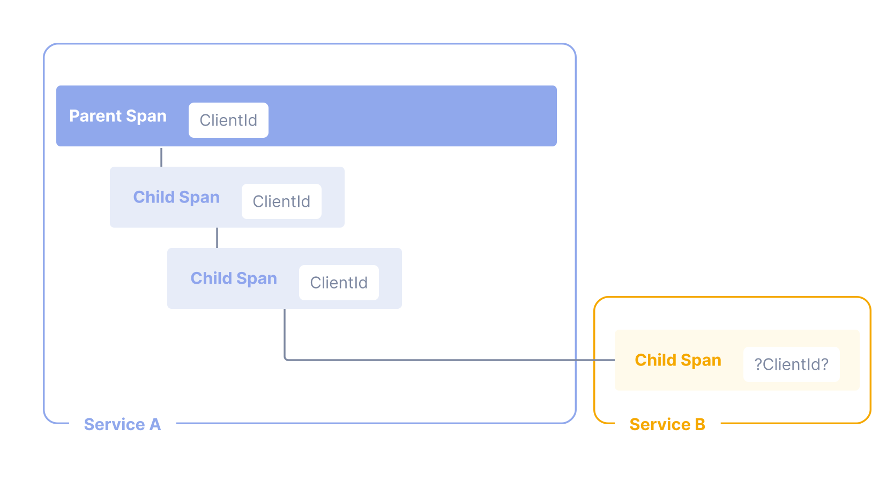
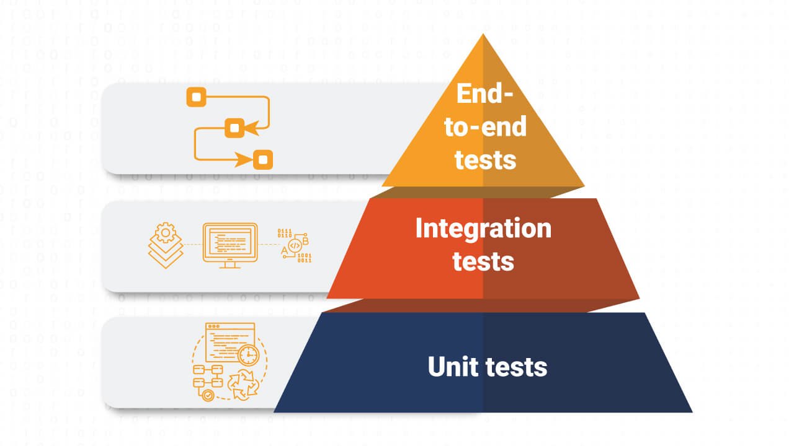

Agenda
======

* Open Telemetry Architecture
* Open Telemetry Signals
  - Traces
  - Metrics
  - Logs
  - Events
  - Baggage
* Enable Azure Monitor OpenTelemetry for Java/Scala App
  - Steps
  - Java agent configuration in sbt
  - Configuration file `applicationinsights.json`
  - Log appender
* Scala Tracing / Metrics API
  - otel4s (OpenTelemetry implementation for Scala Cats)
  - da-ap-pda-nas-telemetry
* Custom Availability Tests (Monitoring)
* AppInsight dashboard
* AppInsight alerts
  - alert rules
  - action groups
* backup slides
  - local environment why it is important
  - k9s - Manage Your Kubernetes Clusters In Style
  - test pyramid


Open Telemetry Architecture
===========================

https://opentelemetry.io/docs/

https://dzone.com/refcardz/getting-started-with-opentelemetry

### Intro

```
Open Telemetry (2019) = OpenTracing (in 2016 became Cloud Native Computing Foundation (CNCF))
                      + OpenCensus (opensourced by Google in 2018)
```

Goals
  * Monitoring    - collects and analyzes telemetry data and acts according to
                    the objectives defined (e.g., alerts, notifies)
  * Observability - is the ability to ask questions about the holistic state
                    of a system through the signals it generates.


Components (more [here](https://opentelemetry.io/docs/what-is-opentelemetry/#main-opentelemetry-components))
  * App
    - API (SDK)
    - Processing
    - Exporter
  * Collector
    - Receivers
    - Processors
    - Exporters
  * Vendor backends for storing and visualising data

```
API -> Processing -> Exporter ------> Receivers -> Processors -> Exporters -> telemtry db
```



Telemetry [signals](https://opentelemetry.io/docs/concepts/signals/)
  - logs
  - metrics
  - traces
  - events (specific type of logs)
  - metadata
  - baggage

Trace
=======

Traces in OpenTelemetry are defined implicitly by their Spans. In particular, a
Trace can be thought of as a directed acyclic graph (DAG) of Spans, where the
edges between Spans are defined as parent/child relationship.

* Components
  - Tracer Provider
  - Tracer
  - Trace Exporters
  - [Context Propagation (traceId, span id)](https://opentelemetry.io/docs/concepts/context-propagation/)
  - Spans
    + Name
    + Parent span ID (empty for root spans)
    + Start and End Timestamps
    + [Span Context](https://opentelemetry.io/docs/concepts/signals/traces/#span-context)
    + Attributes
      - [Semantic conventions](https://github.com/open-telemetry/semantic-conventions/tree/main)
    + Span Events (structured log message)
      - [event vs attribute](https://opentelemetry.io/docs/concepts/signals/traces/#when-to-use-span-events-versus-span-attributes)
    + [Span Links (link related spans)](https://opentelemetry.io/docs/concepts/signals/traces/#span-links)
    + Span Status
      - Unset
      - Error
      - Ok
    + [Span Kind](https://opentelemetry.io/docs/concepts/signals/traces/#span-kind)
      - Client
      - Server
      - Producer
      - Consumer

```
        [Span A]  <-- (the root span)
            |
     +------+------+
     |             |
 [Span B]      [Span C] <-- (Span C is a `child` of Span A)
     |             |
 [Span D]      +---+-------+
               |           |
           [Span E]    [Span F]
```


> hello span

```json
{
  "name": "hello",
  "context": {
    "trace_id": "0x5b8aa5a2d2c872e8321cf37308d69df2",
    "span_id": "0x051581bf3cb55c13"
  },
  "parent_id": null,
  "start_time": "2022-04-29T18:52:58.114201Z",
  "end_time": "2022-04-29T18:52:58.114687Z",
  "attributes": {
    "http.route": "some_route1"
  },
  "events": [
    {
      "name": "Guten Tag!",
      "timestamp": "2022-04-29T18:52:58.114561Z",
      "attributes": {
        "event_attributes": 1
      }
    }
  ]
}
```

> hello-greetings

```json
{
  "name": "hello-greetings",
  "context": {
    "trace_id": "0x5b8aa5a2d2c872e8321cf37308d69df2",
    "span_id": "0x5fb397be34d26b51"
  },
  "parent_id": "0x051581bf3cb55c13",
  "start_time": "2022-04-29T18:52:58.114304Z",
  "end_time": "2022-04-29T22:52:58.114561Z",
  "attributes": {
    "http.route": "some_route2"
  },
  "events": [
    {
      "name": "hey there!",
      "timestamp": "2022-04-29T18:52:58.114561Z",
      "attributes": {
        "event_attributes": 1
      }
    },
    {
      "name": "bye now!",
      "timestamp": "2022-04-29T18:52:58.114585Z",
      "attributes": {
        "event_attributes": 1
      }
    }
  ]
}
```

> hello-salutations

```json
{
  "name": "hello-salutations",
  "context": {
    "trace_id": "0x5b8aa5a2d2c872e8321cf37308d69df2",
    "span_id": "0x93564f51e1abe1c2"
  },
  "parent_id": "0x051581bf3cb55c13",
  "start_time": "2022-04-29T18:52:58.114492Z",
  "end_time": "2022-04-29T18:52:58.114631Z",
  "attributes": {
    "http.route": "some_route3"
  },
  "events": [
    {
      "name": "hey there!",
      "timestamp": "2022-04-29T18:52:58.114561Z",
      "attributes": {
        "event_attributes": 1
      }
    }
  ]
}
```

Metrics
=======

A measurement captured at runtime

https://opentelemetry.io/docs/concepts/signals/metrics

Components
  * `Meter Provider`
  * `Meter`
  * `Metric Exporter`

Metric Instruments
  * `Counter` - value that accumulates (don't goes down)
  * `Asynchronous Counter` (collected once by each export)
  * `UpDownCounter` (like counter but can goes down)
  * `Asynchronous UpDownCounter`
  * `Gauge` - measures a current value at the time it is read
  * `Histogram` -  a client-side aggregation of values
                (How many requests take fewer than 1s?)

Logs
====

A log is a timestamped text record, either structured (recommended) or
unstructured, with metadata.

In OpenTelemetry, any data that is not part of a distributed trace or a metric
is a log.

Events are a specific type of log.

* Components
  - Log Appender / Bridge (`com.microsoft.applicationinsights.logback.ApplicationInsightsAppender`)
  - Logger Provider (`logback`)
  - Logger (`log4cats`)
  - Log Record Exporter
  - Log Record
    + [Log and Event Record Definition](https://opentelemetry.io/docs/specs/otel/logs/data-model/#log-and-event-record-definition)


Baggage
========




Enable Azure Monitor OpenTelemetry for Java/Scala App
=====================================================

## Steps

* Download the `applicationinsights-agent-3.4.14.jar` file.
* Add java agent: `-javaagent:"path/to/applicationinsights-agent-3.4.14.jar"`
* Setup connection string `APPLICATIONINSIGHTS_CONNECTION_STRING=<Your Connection String>`
* Optionally provide configuration file `applicationinsights.json`
* Optionally setup log appender `logback.xml`

For more info click [here](https://learn.microsoft.com/en-us/azure/azure-monitor/app/opentelemetry-enable?tabs=java)

## Java agent configuration in sbt

Add sbt plugin
```
addSbtPlugin("com.github.sbt" % "sbt-javaagent" % "0.1.8")
```
Configure project in `build.sbt` file
```
lazy val core = (project in file("modules/core"))
  ...
  .enablePlugins(JavaAgent)
  .settings(
    ...
    javaAgents += Libraries.AzureAppInsightsAgent,
    ...
  )
```

## Configuration file `applicationinsights.json`

When using `sbt-native-packager` put config into `src/universal` directory
```
.
├── README.md
├── azure-jdk-setup.yml
├── azure-pipelines.yml
├── build.sbt
├── docker-compose.yml
├── modules
│   ├── core
│   │   └── src
│   │       ├── main
│   │       │   ├── resources
│   │       │   │   ├── application.conf
│   │       │   │   ├── db
│   │       │   │   ├── logback.xml
│   │       │   │   └── swagger
│   │       │   └── scala
│   │       │       ├── com
│   │       │       └── db
│   │       └── universal
│   │           └── applicationinsights-agent
│   │               └── applicationinsights.json
│   └── tests
│       └── src
│           ├── it
│           │   ├── resources
│           │   │   └── logback-test.xml
│           │   └── scala
│           │       └── com
│           ├── main
│           │   ├── resources
│           │   │   └── logback.xml
│           │   └── scala
│           │       └── com
│           └── test
│               └── scala
│                   └── com
└── mysql.sh
```

Example config could look following ([full reference](https://learn.microsoft.com/en-us/azure/azure-monitor/app/java-standalone-config))

```
{
  "connectionString": "...",
  "role": {
    "name": "my cloud role name"
  },
  "sampling": {
    "percentage": 100
  },
  "jmxMetrics": [
  ],
  "customDimensions": {
  },
  "instrumentation": {
    "logging": {
      "level": "INFO"
    },
    "micrometer": {
      "enabled": true
    }
  },
  "proxy": {
  },
  "preview": {
    "processors": [
    ]
  },
  "selfDiagnostics": {
    "destination": "file+console",
    "level": "INFO",
    "file": {
      "path": "applicationinsights.log",
      "maxSizeMb": 5,
      "maxHistory": 1
    }
  }
}
```

What can be set in `applicationinsights.json` (more [here](https://learn.microsoft.com/en-us/azure/azure-monitor/app/java-standalone-config))
* sampling
* custom dimension
* [jmx metrics](https://learn.microsoft.com/en-us/azure/azure-monitor/app/java-jmx-metrics-configuration)
  - how to find out what metrics are available?
* [auto collected telemetry](https://learn.microsoft.com/en-us/azure/azure-monitor/app/java-standalone-config#suppress-specific-autocollected-telemetry) (enable / disable)
* edit / remove / change / add attributes
  - [telemetry processors](https://learn.microsoft.com/en-us/azure/azure-monitor/app/java-standalone-telemetry-processors)
* self diagnostics (on / off)

### Custom dimension

`applicationinsights.json`
```
{
  "customDimensions": {
    "buildVersion": "${BUILD_INFO_VERSION}"
  },
}
```

In `build.sbt`
```
lazy val core = (project in file("modules/core"))
  ...
  .enablePlugins(DockerPlugin)
  .enablePlugins(AshScriptPlugin)
  ...
  .settings(
    ...
    dockerEnvVars := Map("BUILD_INFO_VERSION" -> version.value)
    ...
  )
```
## Log appender

`logback.xml`
```
<configuration>
  <appender name="STDOUT" class="ch.qos.logback.core.ConsoleAppender">
    <encoder>
      <pattern>
        %d{yyyy-MM-dd HH:mm:ss.SSS} [%thread] %highlight(%-5level) %cyan(%logger{36}) - %msg%n
      </pattern>
    </encoder>
  </appender>

  <appender name="APPLICATION_INSIGHTS" 
    class="com.microsoft.applicationinsights.logback.ApplicationInsightsAppender"/>

  <root level="${LOG_LEVEL_ROOT:-INFO}">
    <appender-ref ref="STDOUT"/>
    <appender-ref ref="APPLICATION_INSIGHTS"/>
  </root>
</configuration>
```

dependency
```
"com.microsoft.azure" % "applicationinsights-logging-logback" % 2.6.4
```

Scala Tracing / Metrics API
===========================

* [otel4s](https://typelevel.org/otel4s/index.html) (OpenTelemetry implementation for Scala Cats)
* da-ap-pda-nas-telemetry
  - is aligned with [semantic conventions](https://github.com/open-telemetry/semantic-conventions/tree/main)


Modules
* `otel4s-core`
* `otel4s-sdk` - under development, not published yet
* `otel4s-oteljava` (we use this)

Problems
* context propagation
  - auto collected metrics + custom tracing with otel4s

> Let's explore the TNC API codebase together.

Custom Availability Tests
===========================

* In pg env it is hard to utilize standard availability tests
* Implemented using Appinsight Classic API

```
"com.microsoft.azure" % "applicationinsights-core" % 3.5.1
```

```scala
import cats.effect.implicits._
import cats.effect.{Async, Concurrent, Sync, Temporal}
import cats.syntax.all._
import com.microsoft.applicationinsights.TelemetryClient
import com.microsoft.applicationinsights.internal.util.LocalStringsUtils
import com.microsoft.applicationinsights.telemetry.{AvailabilityTelemetry, Duration}
import doobie.Transactor
import doobie.implicits._
import io.circe.syntax._
import scala.concurrent.duration._
import org.typelevel.log4cats.Logger

case class Databases(conductorConn: Boolean, nasConn: Boolean)
case class AppStatus(databases: Databases)

val status: F[AppStatus] = ???

def trackAvailability: F[Unit] =
  availabilityTelemetry
    .flatMap(telemetry => availabilityTest(telemetry))
    .andWait(cfg.availabilityTestInterval)
    .recoverWith { case err =>
      val telemetry = newAvailabilityTelemetry
      telemetry.setSuccess(false)
      telemetry.setMessage(err.toString)
      Logger[F].error(err)("Error during availability check") >>
        availabilityTest(telemetry).attempt.void
    }
    .foreverM

private def availabilityTelemetry: F[AvailabilityTelemetry] =
  status.timed.map { case (ts, status) =>
    val telemetry = newAvailabilityTelemetry
    telemetry.setSuccess(status.databases.conductorConn && status.databases.nasConn)
    if (!telemetry.getSuccess) {
      telemetry.setMessage(status.asJson.noSpaces)
    }
    telemetry.setDuration(new Duration(ts.toMillis))
    telemetry
  }

private def newAvailabilityTelemetry = {
  val telemetry = new AvailabilityTelemetry()
  telemetry.setName(cfg.name.value)
  telemetry.setRunLocation(cfg.runLocation.value)
  telemetry.setId(LocalStringsUtils.generateRandomIntegerId())
  telemetry
}

```

AppInsight dashboard
====================

* Explore nas-tnc-appinsight general dashboard
  - browsing logs
  - browsing exceptions
  - browsing requests
  - exploring metrics
    - overriding time settings
* how to create your own dashboard
  - local
  - shared

AppInsight Alerts (Monitoring)
==============================

* Alert rules
* Action groups
  - sending emails
  - sending message to teams
    + ms teams incoming webhook not compatible with appinsight action groups webhook
    + solution le's write a [bridge](https://github.com/ssledz/appinsights-msteams-bridge)
* Let's test alerts

Backup slides
==============

# Local environment why it is important ?

* speeds work
* easier to debug

# k9s

Manage Your Kubernetes Clusters In Style

# test pyramid



How to utilize interfaces to easier your work

Resources
=========

* [What is OpenTelemetry?](https://opentelemetry.io/docs/what-is-opentelemetry/)
* [Semantic Conventions for HTTP Spans](https://github.com/open-telemetry/semantic-conventions/blob/main/docs/http/http-spans.md)
* [Semantic Conventions for HTTP Metrics](https://github.com/open-telemetry/semantic-conventions/blob/main/docs/http/http-metrics.md)
* [Semantic Conventions for Exceptions on Spans](https://github.com/open-telemetry/semantic-conventions/blob/main/docs/exceptions/exceptions-spans.md)
* [Semantic Conventions for Database Client Calls](https://github.com/open-telemetry/semantic-conventions/blob/main/docs/database/database-spans.md)
* [Semantic Conventions for Database Metrics](https://github.com/open-telemetry/semantic-conventions/blob/main/docs/database/database-metrics.md)
* [Semantic Conventions for JVM Metrics](https://github.com/open-telemetry/semantic-conventions/blob/main/docs/runtime/jvm-metrics.md)
* [Enable Azure Monitor OpenTelemetry for .NET, Node.js, Python, and Java applications](https://learn.microsoft.com/en-us/azure/azure-monitor/app/opentelemetry-enable?tabs=java)
* [ApplicationInsights-Java](https://github.com/microsoft/ApplicationInsights-Java)
* [otel4s](https://typelevel.org/otel4s/index.html)

